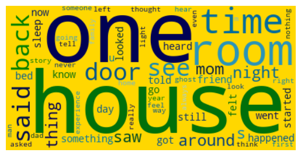
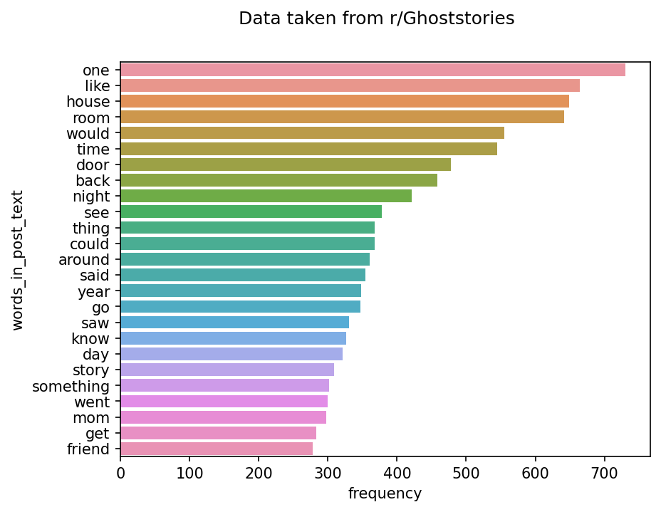

# About
A single script that brings the top 10 posts of r/Ghoststories daily and creates some images with word frequency like so:




## Prerequisites
- Have a reddit account
- Enable [reddit's API](https://www.reddit.com/wiki/api/)
- Configure [PRAW(The Python Reddit API Wrapper)](https://praw.readthedocs.io/en/stable/getting_started/configuration/options.html#configuration-options)

## Run it in your machine
The project has a pyptoject.toml and uses Poetry. To install Poetry checkout [it's documentation](https://python-poetry.org/docs/). You can install the dependencies easily running the following command in the root folder of the project:
```
poetry install
```
The script can be easily modified to scrape another subreddit of your choice. Have fun!